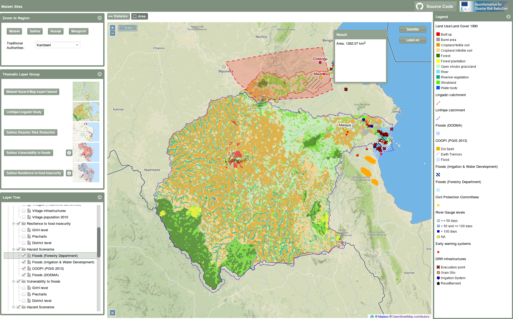

# MalawiAtlas

This repository contains the code for the "Malawi Atlas"  web application.



## How to run:

* Clone the repository. the switch `--recursive` also downloads the [GeoExt3](https://github.com/geoext/geoext3) library as a git submodule.

    ```shell
    git clone --recursive https://github.com/ZGIS/malawi_atlas.git
    ```

* (if you forgot the `--recursive` flag,  you can download the submodule like this):

    ```shell
    git submodule update --init --recursive
    ```

* navigate to the `webapp` directory:

    ```shell
    cd webapp
    ```

* Download Sencha Ext JS `6.2.0` from [here](https://www.sencha.com/legal/GPL/). Then run:

    ```shell
    sencha app install --framework=C:/sencha/sdks/ext-6.2.0
    sencha app watch
    ```

Tested with Sencha Cmd v6.6 and Ext JS 6.2 (GPL).

