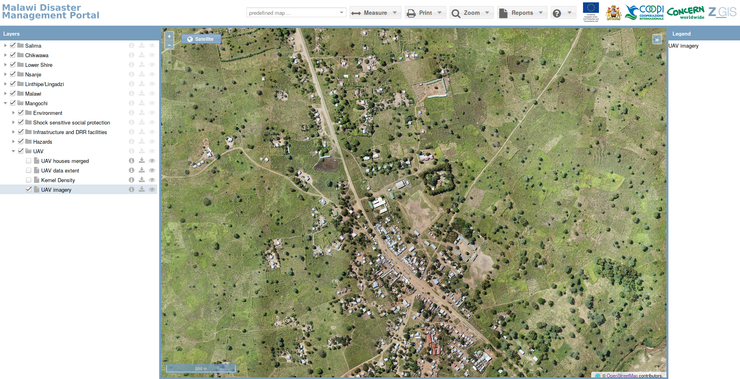

.. Malawi Atlas documentation master file, created by
   sphinx-quickstart on Tue Sep 11 10:33:36 2018.
   You can adapt this file completely to your liking, but it should at least
   contain the root `toctree` directive.

Welcome to Malawi Atlas's documentation!
========================================

The Malawi Atlas `website <https://www.gis-malawi.com/malawi_atlas>`_ displays geodata of various topics like natural
hazards, vulnerability, resilience, risk reduction and demographics.

.. toctree::
   :maxdepth: 2

   overview
   website
   qgis
   server
   masdap_integration
