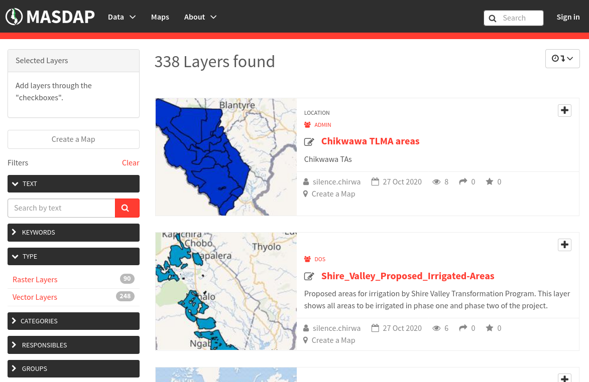
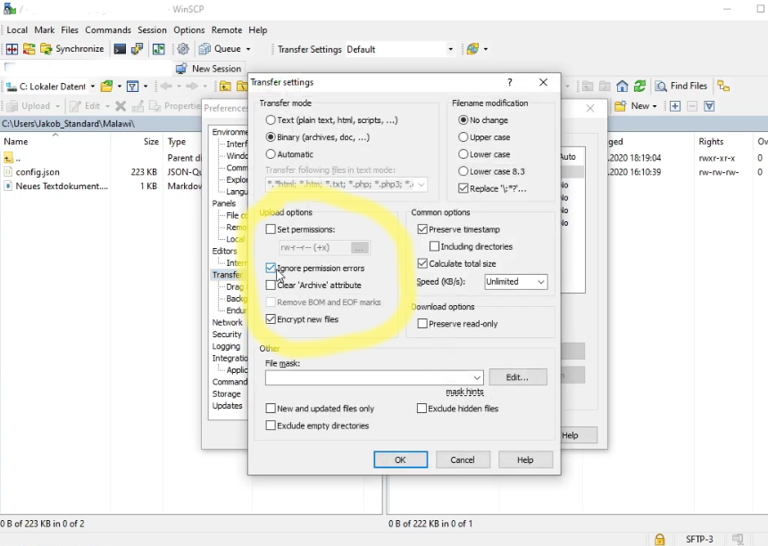
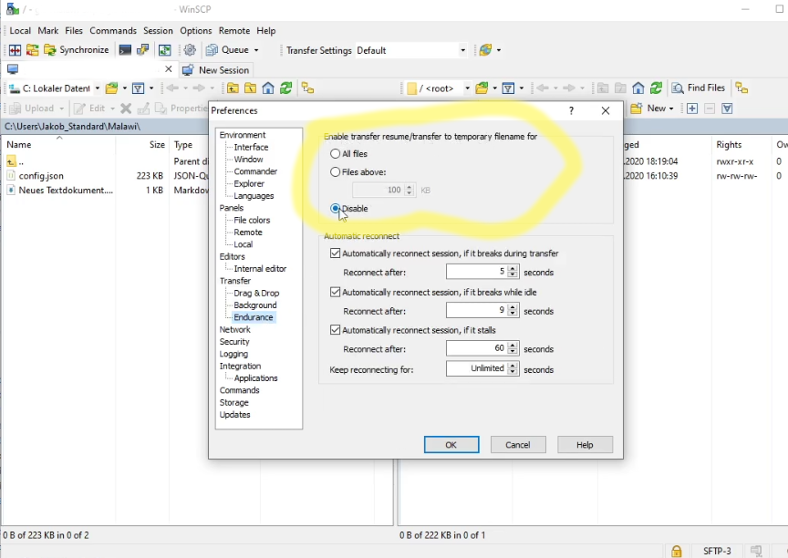

MASDAP Integration
==================

`MASDAP <http://www.masdap.mw/>`_ is an open data portal that hosts geodata and its metadata and makes it publicly available. The whole process of integrating MASDAP into the Malawi Atlas are also explained in a video tutorial that can received upon request. 

Integration of layers in Malawi Atlas
-------------------------------------

Every layer of MASDAP can be displayed in the Malawi Atlas by adding a new entry to the configuration file, like this examples shows:

.. code-block:: json

  {
    "layer_type": "WMS",
    "url": "http://www.masdap.mw/geoserver/ows?service=WMS",
    "title": "DEM_Hillshade_Mzuzu_10m",
    "name": "DEM_Hillshade_Mzuzu_10m"
  },

Uploading Layers to MASDAP
--------------------------

MASDAP is an instance of `GeoNode <http://geonode.org/>`, which is user friendly web portal for managing and uploading geodata. Before uploading a layer to MASDAP is it necessary to register on the website. This can be done by contacting the MASDAP team via email. 

The general functionality of MASDAP can be found in the GeoNode `documentation <https://docs.geonode.org/en/master/usage/index.html>`. There is also described how to upload layers, in general this process is very user friendly and can be conducted inside the web browser. Allowed filetypes are ``GeoJSON``, ``CSV`` and ``Shapefile``. 

.. _masdap-modify-config-ref:

Modifying the Configuration File 
--------------------------------

The configuration file can be changed by the admins of the Malawi Atlas by using a FTP access. The respective credentials are provided on request. Basically the configuration file is a JSON document. There are multiple ways how to edit the configuration file.

The best way is to download the configuration file from the server and edit it locally. Alternatively the configuration file can be `downloaded from GitHub <https://github.com/ZGIS/malawi_atlas_public/blob/master/webapp/resources/config/config.json>` as well. The downloaded file can be edited with any text editor. Typical choices are Notepad++ or VS Code. 

Once the configuration file has been edited it has to be uploaded to the server again. This can be done with FTP commandline tools. Alternatively there are programs with a user interface like `WinSCP <https://winscp.net/eng/download.php>` that support the uploading process a lot. It is even possible to edit the configuration file directly with WinSCP. However, this should only be used for small edits, since the no syntax highlighting is provided. 

Independent of the way of editing it is strongly recommended to create a backup of the configuration before editing. Since, the config file is quite, it is not unlikely that an error during the editing process happens. Once an error has occurred, the backuped config file can be uploaded on the server again in order to keep the website running. 

Settings for WinSCP
-------------------

When using WinSCP it is recommended to make two adjustments of the settings. First, the tick "Ignore permission errors" needs to be set. This can by done via "Preferences" --> "Transfer Settings". It should look like in the screenshot below.

Secondly, the creation of temporary transfer files should be disabled. This can be done via "Preferences" --> "Transfer" --> "Endurance". It should look like in the screenshot below.

