.. _oam-tutorial-ref:

Integrating Data from OpenAerialMap into the Malawi Atlas
=========================================================

`OpenAerialMap <https://openaerialmap.org/>`_ (OAM) is a set of tools for searching, sharing, and using openly licensed
satellite and unmanned aerial vehicle (UAV) imagery. OAM solely provides its imagery as WMTS or TMS. Those cannot be
integrated directly into the website at the moment. To make those layers available the WMTS protocol needs to be
translated to WMS. This tutorial can be used as general template to integrate different WMTS sources into Malawi Atlas.

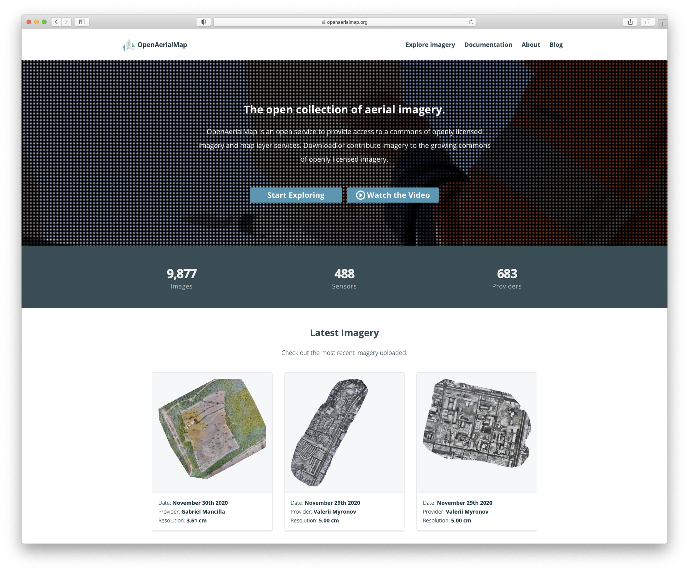

Finding WMTS capabilities on OAM
--------------------------------

Find the desired imagery on OAM and open it by clicking on it.

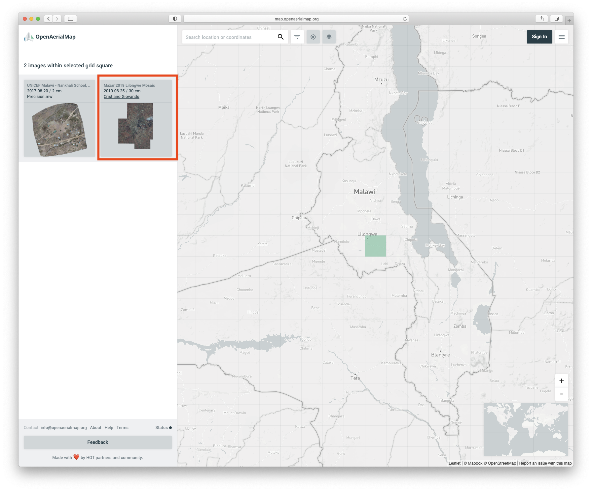

After opening the imagery next to "Copy image URL" it a WMTS button. Clicking it will copy the Capacities-URL into the
clipboard. Paste this link into a textfile as this is needed in a later step.

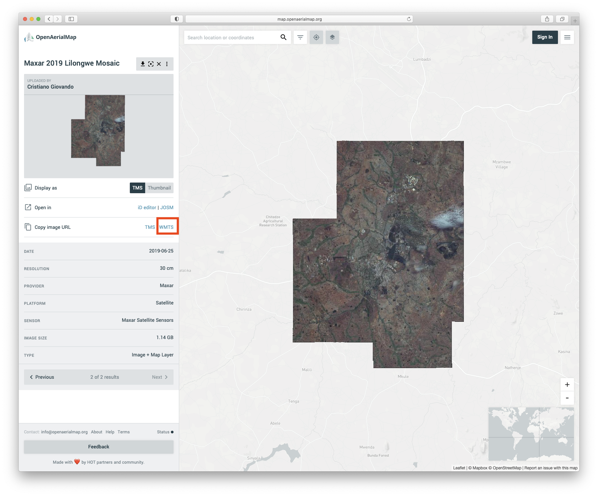

Exampe URL: https://tiles.openaerialmap.org/5eba341080832d00073367a4/0/5eba341080832d00073367a5/wmts

Integrating layer into Geoserver
--------------------------------

Login to the `GIS-Malawi Geoserver <https://www.gis-malawi.com/geoserver>`__.

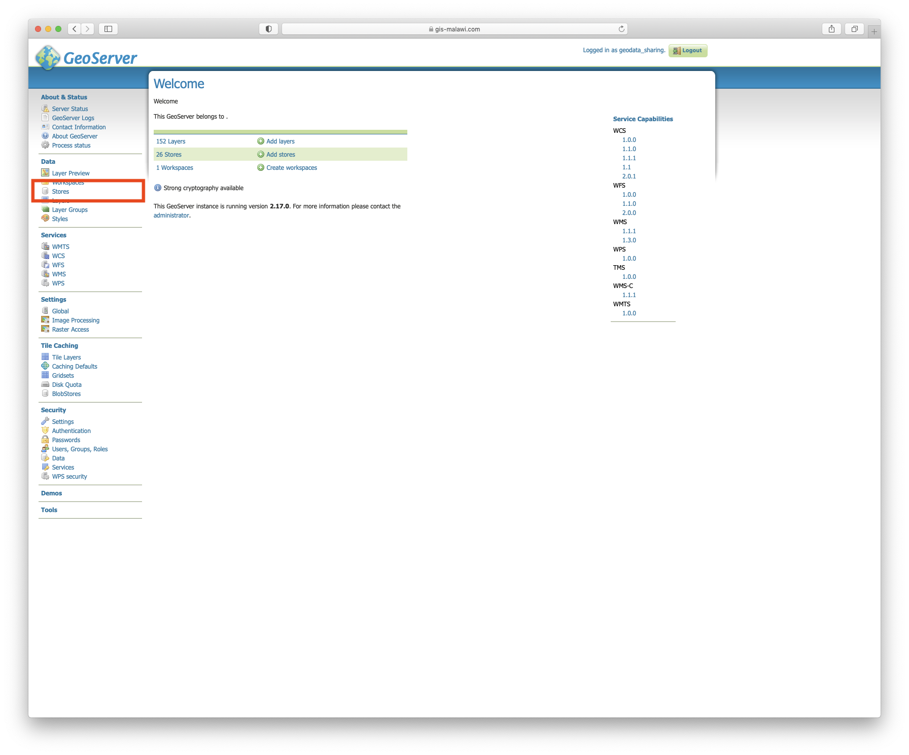

Navigate to the
`stores section <https://www.gis-malawi.com/geoserver/web/wicket/bookmarkable/org.geoserver.web.data.store.StorePage>`__
and select ``add store``.

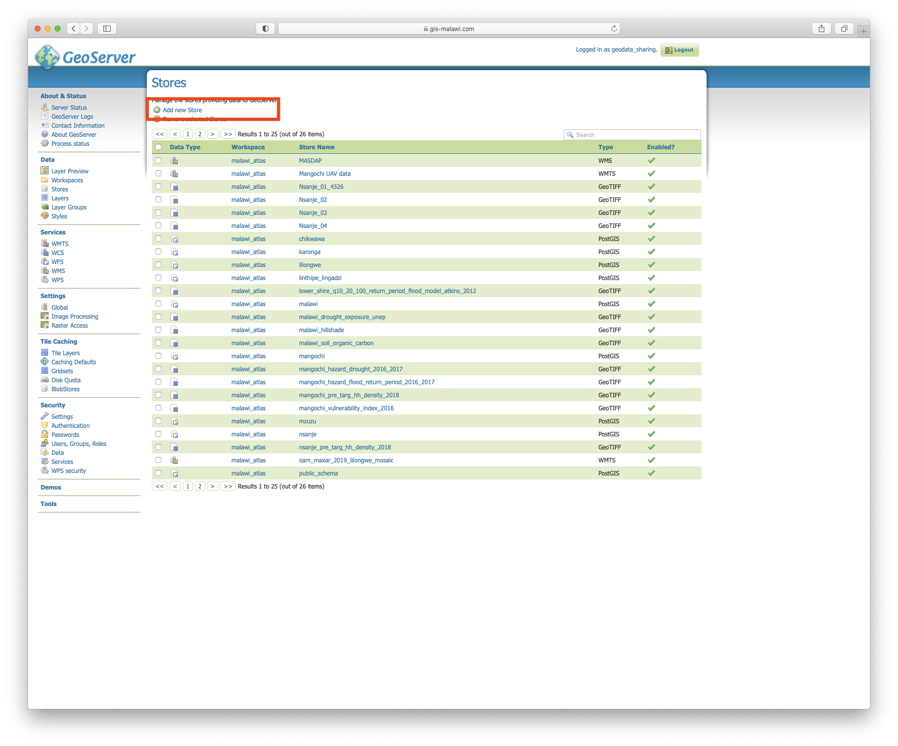

Select ``WMTS - Cascades a remote Web Map Tile Service``.

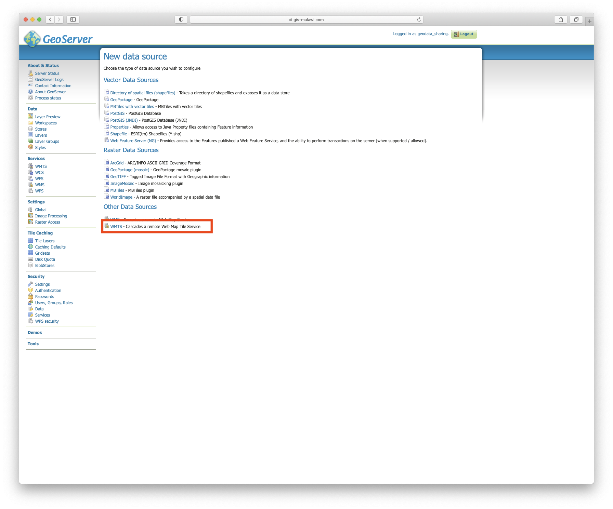

Paste the URL you saved into ``Capabilities URL`` and give the datasource a name and a description. *NOTE* Make sure to
pick a name without spaces, special characters or similar. Best copy the title of the OAM source, make it lowercase, and
replace all spaces with underscore ``_``. Leave the rest default and save.

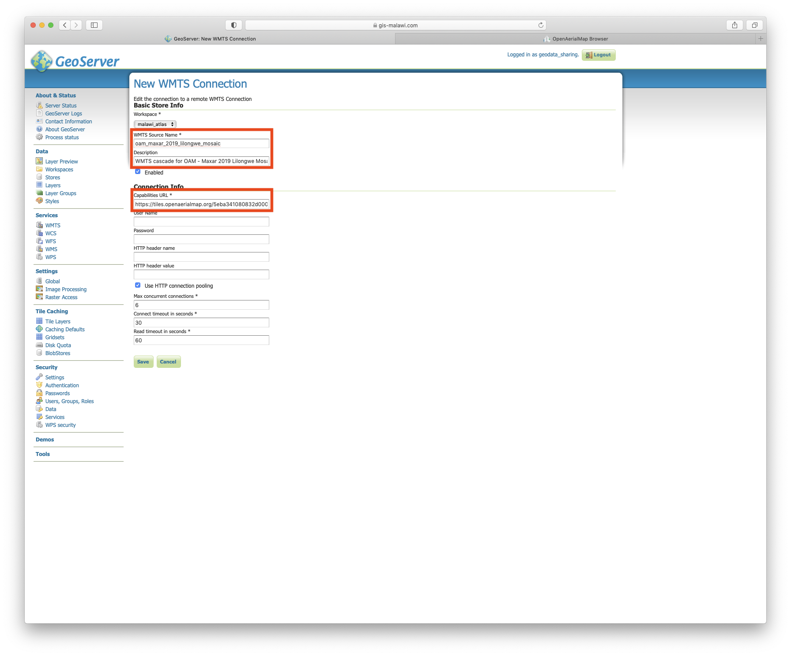

The next page will show all the layers contained within the capabilities URL. For OAM this is generally only one layer.
*NOTE* Unfortunately the layername is often 'None'. This has been chosen by the uploader and is not an error made by
Geoserver. Click ``publish`` to create the new layer.

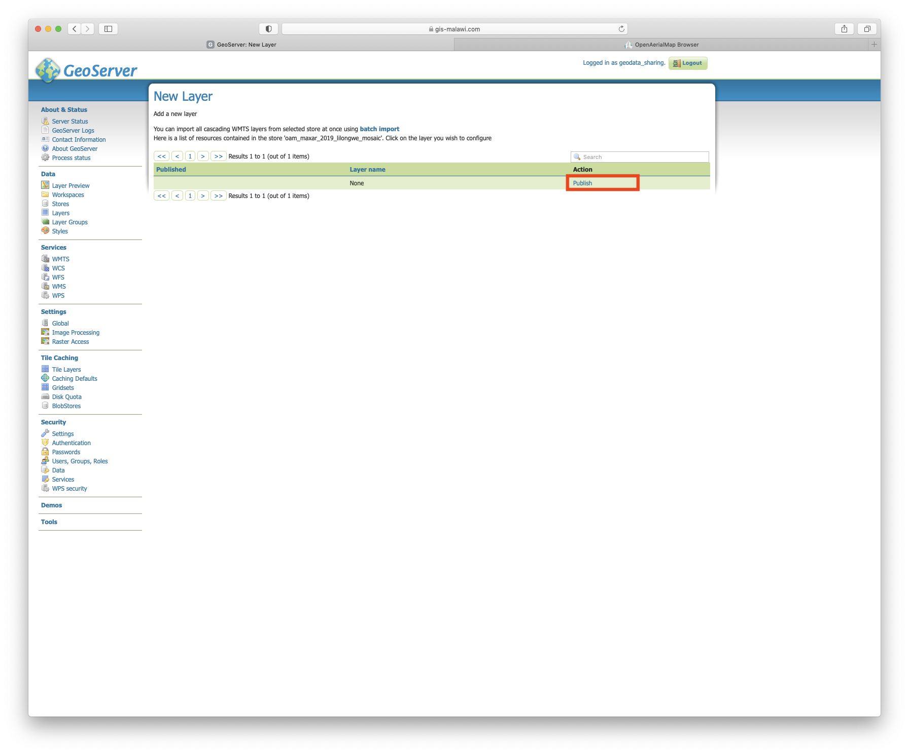

In the next page you can edit the layer properties. Most important it to choose a proper name, that follows the Malawi
Atlas :ref:`naming conventions <server-data-organization-ref>`. Make sure to link to the source in the Abstract, pick
a propert title, and some descriptive keywords. Leave the rest defaults and save.

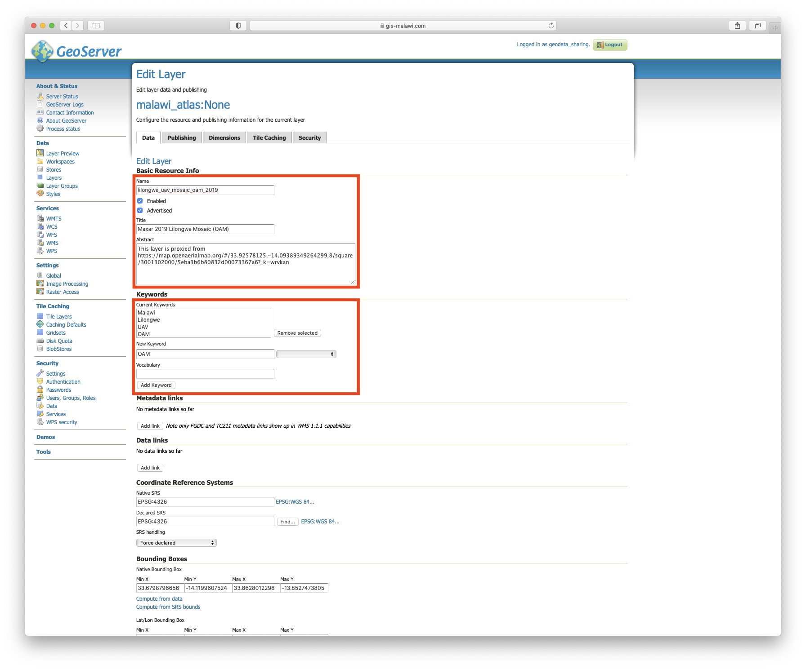

In the ``layer preview`` section you can test if the layer was imported correctly.

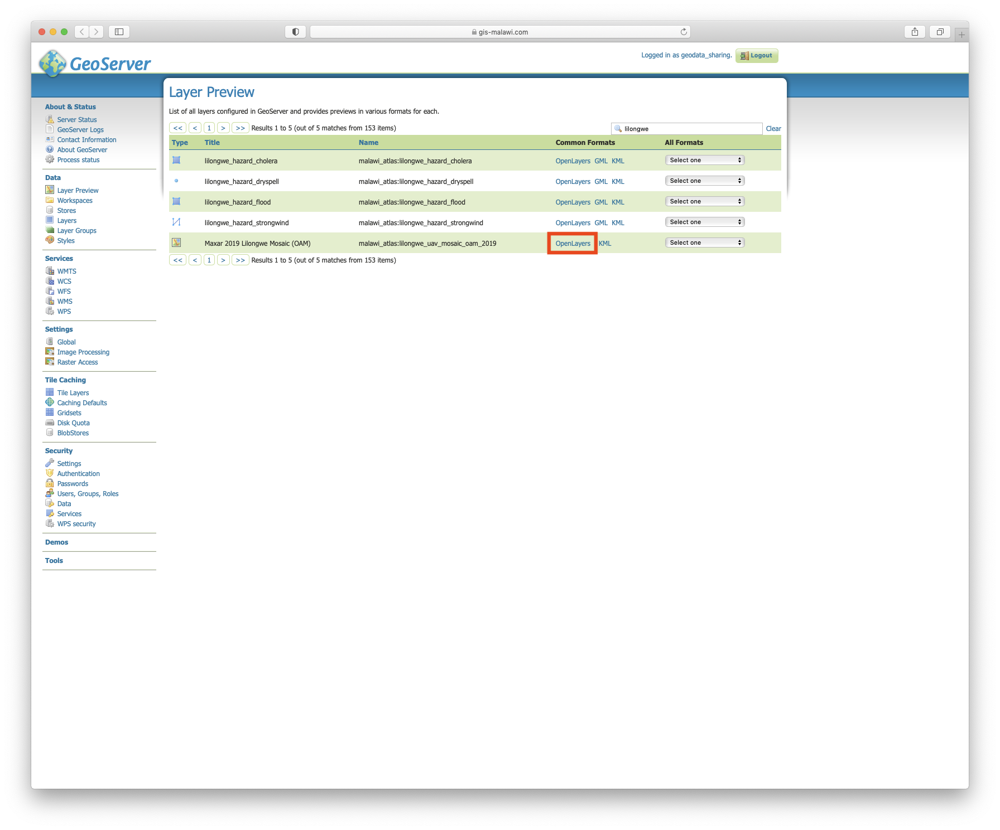

Click the ``OpenLayers`` link and the layer should open in a new tab. When opening the layer for the first time it might
take a while before it is displayed.

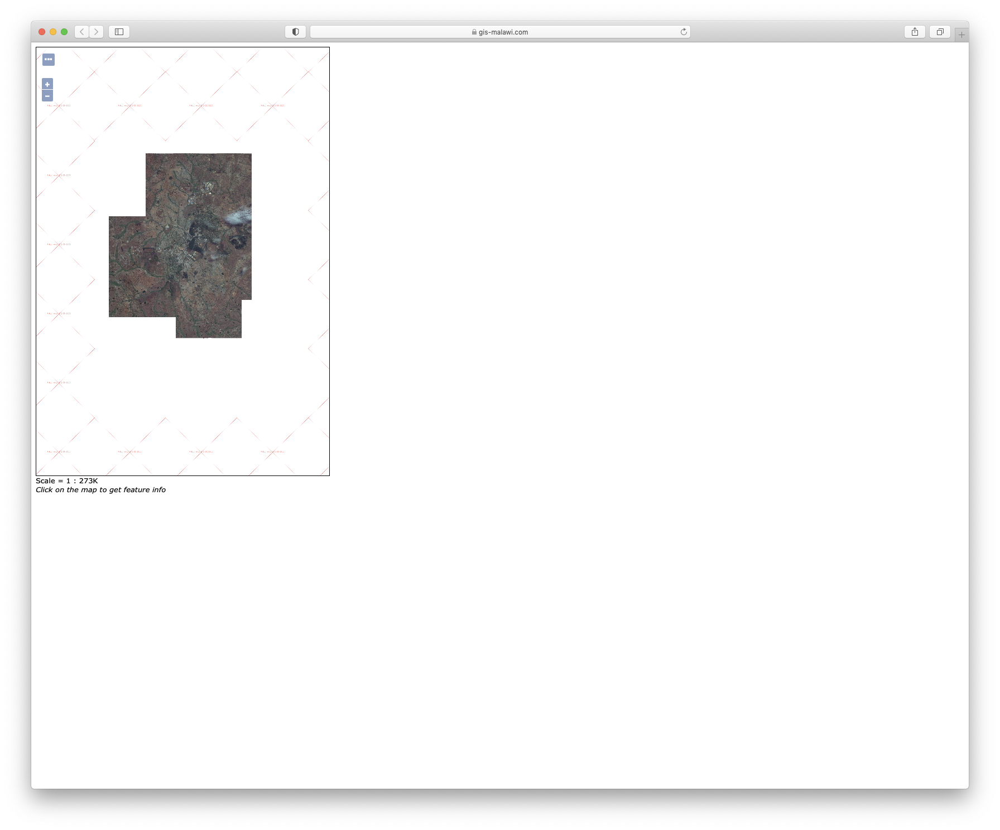

Modifying the Configuration File
--------------------------------

How to modify and upload the configuration file is described in the :ref:`MASDAP Integration tutorial <masdap-modify-config-ref>`.

This is the example layer section for the configuration file to integrate the layer from the tutorial:

.. code-block:: json

  {
    "layer_type": "WMS",
    "url": "https://www.gis-malawi.com/geoserver/malawi_atlas/wms",
    "title": "Maxar 2019 Lilongwe Mosaic (OAM)",
    "name": "lilongwe_uav_mosaic_oam_2019",
    "thematicGroup": "LILONGWE_PGIS",
    "description": "UAV images proxied from OpenArialMap",
    "source": "OpenAerialMap (Maxar)",
    "year": 2019,
    "layer_extent": "Lilongwe",
    "projection": "WGS 84 (EPSG: 4326)",
    "is_raster": true
  },
