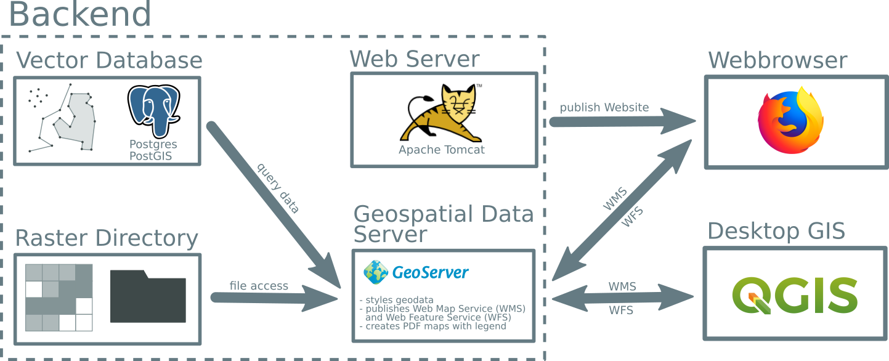

Overview
========

Most of the data is vector data e.g. the underlying features are either points, lines or polygons. Some of the data is stored as raster and is located in the file system.

The vector data is stored in a `PostgreSQL <https://www.postgresql.org/>`_ database using the `PostGIS <https://postgis.net/>`_ extension. Originally the data was stored in the Shapefile format. Each of these files became converted into a database table. All tables are structure in schemas. These are a kind of folder in order to organize the data.

The program `GeoServer <https://geoserver.org/>`_ publishes the geodata according to the WMS and WFS standard. It styles the layers and creates a legend.

All layers of Malawi Atlas can also be displayed in a desktop GIS like `QGIS <https://qgis.org/en/site/>`_. But also websites like Malawi Atlas can display the layers.

The Malawi Atlas website uses the `Ext JS <https://www.sencha.com/products/extjs/>`_ framework. This makes it possible to create a feature rich website that feels like a desktop application. For displaying the geodata the JavaScript library `OpenLayers <https://openlayers.org/>`_ and the Ext component `GeoExt <https://geoext.github.io/geoext3/>`_ are used.
