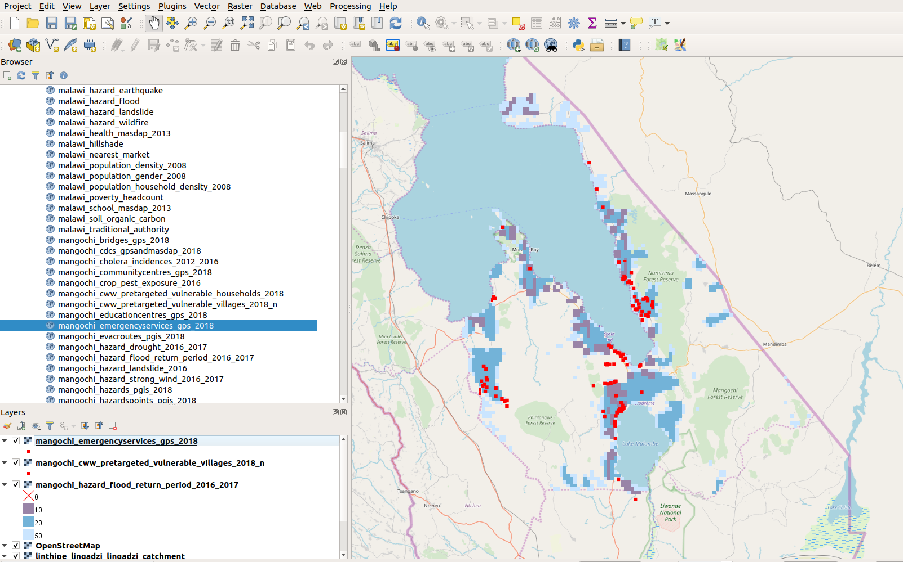
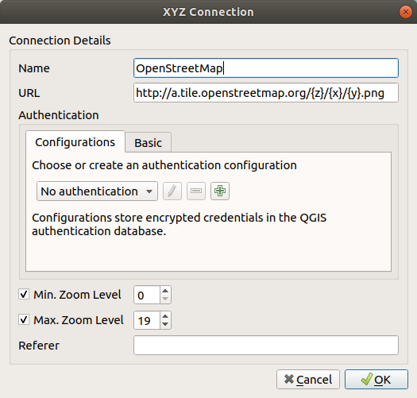
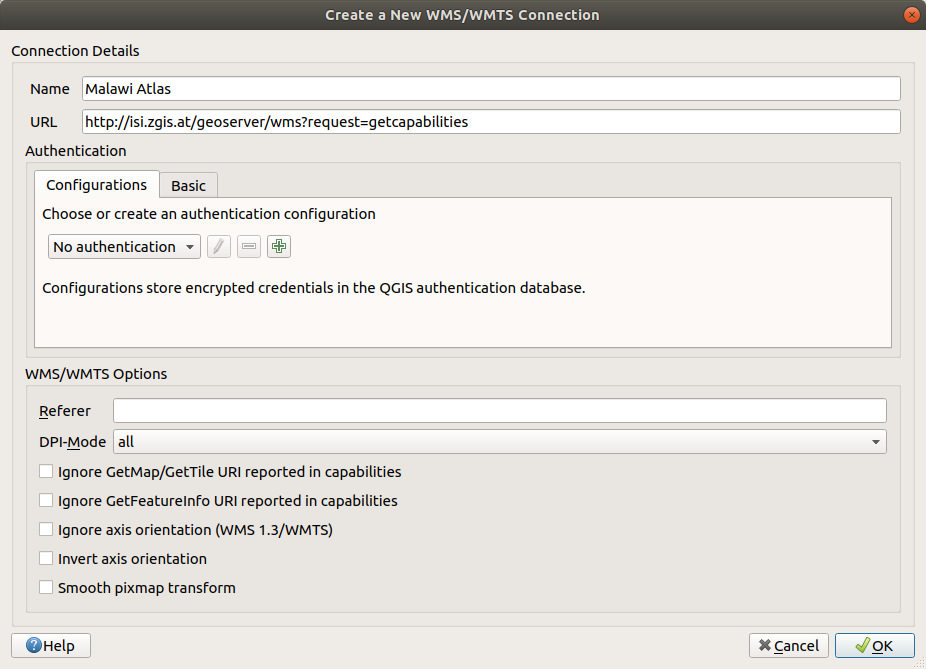
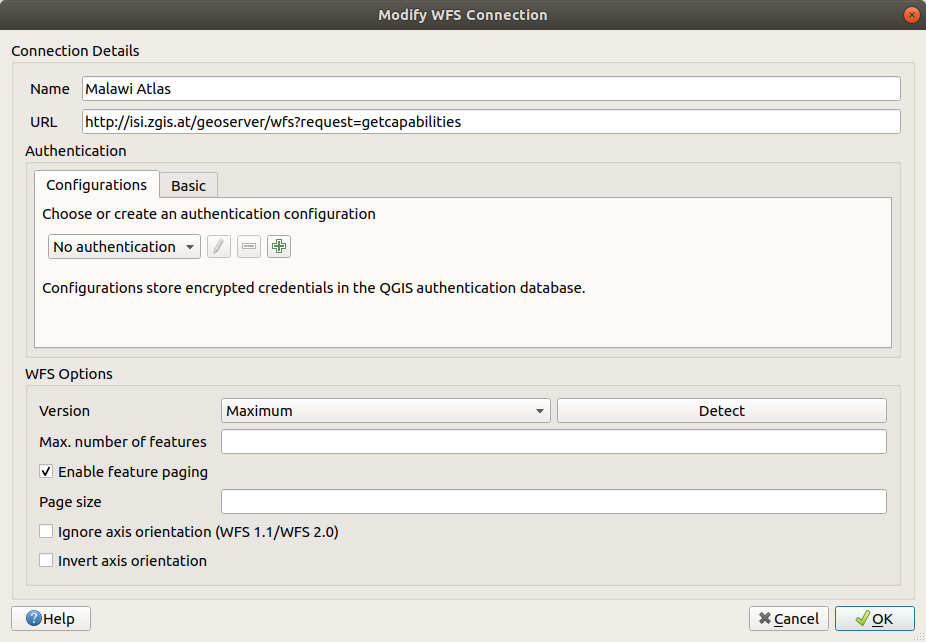
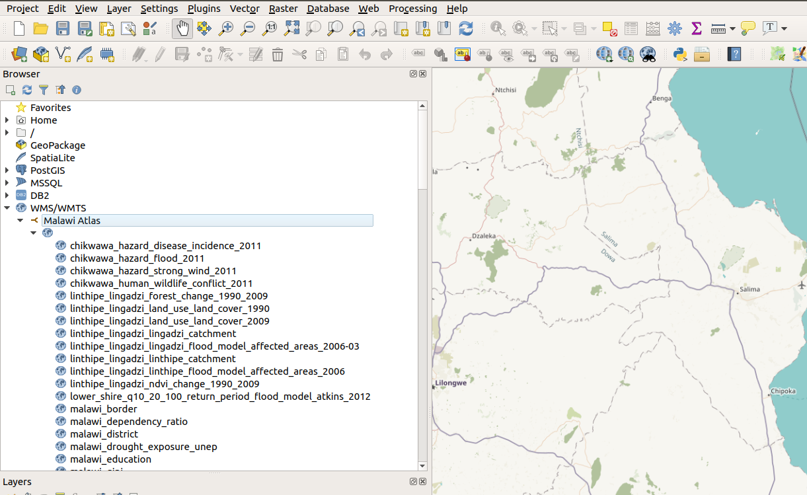
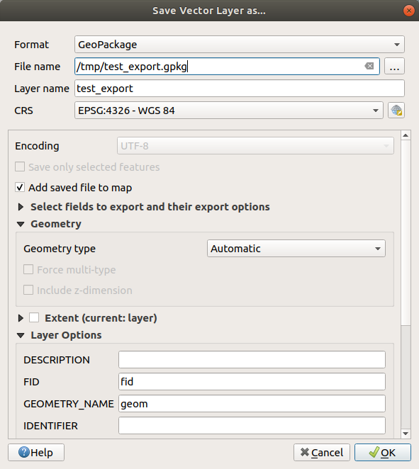

QGIS
====

Even though the data from "Malawi Atlas" can be downloaded via the website, it can also be useful to view the data directly in QGIS. Please note, that a stable internet connection is required.

Installation
************

`QGIS <https://www.qgis.org/>`_ is a desktop program that runs on Windows, Mac and Linux. It is free and open source, meaning that it is developed by a worldwide community. It does not cost anything. 

Basemap
*******

In order to see a basemap (a map in the background) it is necessary to connect to a ``XYZ Tile Service``. In your QGIS ``Browser`` panel, navigate to ``XYZ Tiles``. Right click and choose ``New Connection`` and enter the following values:

Name: ``OpenStreetmap``

URL:  ``http://tile.openstreetmap.org/%7Bz%7D/%7Bx%7D/%7By%7D.png``

Like in this screenshot.

For another basemap enter these values:

Name: ``OpenStreetMap H.O.T.``

URL:  ``http://tile.openstreetmap.fr/hot/%7Bz%7D/%7Bx%7D/%7By%7D.png``

Accessing Malawi Atlas
***********************

The data from the Malawi Atlas can be accessed via the Web Map Service (WMS) and the Web Feature Service (WFS).

Setup
-----

The setup for both WMS and WFS works almost identically:

WMS
^^^

In QGIS, go to your ``browser`` panel, right-click on ``WMS/WMTS`` and select ``New Connection ...``. Enter these values:

Name: ``Malawi Atlas WMS``

URL : ``http://gis-malawi.com/geoserver/wms?request=getcapabilities``

WFS
^^^

In QGIS, go to your ``browser`` panel, right-click on ``WFS`` and select ``New Connection ...``. Enter these values:

Name: ``Malawi Atlas WFS``

URL : ``http://gis-malawi.com/geoserver/wfs?request=getcapabilities``

View data
---------

It might be necessary to restart QGIS, after the setup. When the WFS and the WMS are successfully set up, it should be possible to view all available layers like in this image:

Then, the layers can be dragged inside the QGIS map.

The WMS layers show the exact same styling as in the Malawi Atlas website. The WFS layers in contrast show no styling, but the contain the actual data. This means, it is possible to see the attribute table. A WFS layer can be exported in many other formats like GeoPackage, Shapefile or CSV. In order to do this, go to the ``Layers`` panel, right-click on a WFS layer and choose ``Export`` --> ``Save Features As ...`` . Then a window will open where the ``Format``, the ``File Name`` and the Coordinate Reference System (``CRS``) can be chosen.

