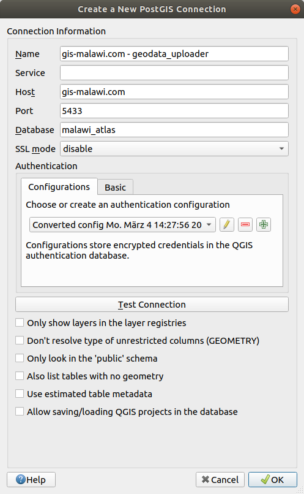

******
Server
******

The `Malawi Atlas website <isi.zgis.at/malawi_atlas>`_ is the visible part of the project. In the background there is a server running that stores all geodata and publishes it to the internet.

Software
========

The operating system of the server can either be Linux or Windows.

Apache HTTP Server
------------------

The website is served by the `Apache HTTP Server <https://httpd.apache.org/>`_ .

GeoServer
---------

GeoServer is be installed as standalone application like described in the `docs <https://docs.geoserver.org/stable/en/user/installation/linux.html>`_.

It is recommended to create a directory that holds all GeoServer related files. This makes the update of the GeoServer much easier. The instructions how to change the data directory can be found `here <https://docs.geoserver.org/stable/en/user/datadirectory/setting.html>`_ .

For using the GeoServer folder of the Malawi Atlas you need to take the existing `geoserver_data` folder and place it on an convenient location on your server. Afterwards point GeoServer on this location like explained in the link before and restart the Geoserver.

For some requests it is necessary to change some ``CORS`` settings. In the current Malawi Atlas we modified the ``web.xml`` according to this `instruction <https://docs.geoserver.org/latest/en/user/production/container.html#enable-cors>`_ .

PostgreSQL
----------

The database PostgreSQL stores all vector data of the Malawi Atlas. It can be downloaded from the official `website <https://www.postgresql.org/download/>`_  or via the package manager of the operating system (in case of Linux).  For security purposes it is recommended to not open the PostgreSQL port to the public. Hence, the database shall only be accessed locally by GeoServer. For inserting data it is necessary to use a ``role`` that has writing permissions. However, GeoServer does only need reading permission and should therefore use an own ``geoserver_reader`` role. This SQL snipped can be used (modified from this `source <https://gist.github.com/oinopion/4a207726edba8b99fd0be31cb28124d0>`_):

.. code-block:: sql

  -- Create a group
  CREATE ROLE readaccess;

  -- Grant access to existing tables
  GRANT USAGE ON SCHEMA public TO readaccess;
  GRANT SELECT ON ALL TABLES IN SCHEMA public TO readaccess;

  -- Grant access to future tables
  ALTER DEFAULT PRIVILEGES IN SCHEMA public GRANT SELECT ON TABLES TO readaccess;

  -- Create a final user with password
  CREATE USER geoserver_reader WITH PASSWORD 'my_very_long_dummy_password_with_special_characters_and_numbers123!';
  GRANT readaccess TO geoserver_reader;

For storing spatial data it is necessary to also install `PostGIS <https://postgis.net>`_. The installation instructions can be found on the official `documentation <https://postgis.net/install/>`_.

We used PostgrSQL version ``11`` and PostGIS version ``2.5``, however Malawi Atlas should actually work well with the lastest versions of both.

In order to populate the database you need the database dump. Afterwards you can load the data into PostGIS using this command:

.. code-block:: shell

  psql malawi_atlas < malawi_atlas_dump.sql

Ext JS
------

Ext JS provides the JavaScript framework that Malawi Atlas uses. It can be downloaded on this `website <https://www.sencha.com/legal/GPL/>`_. Additionally for building the website the command line tool `Sencha CMD <https://www.sencha.com/products/extjs/cmd-download/>`_ is required. The source code of the Malawi Atlas and further instructions how build the website can be found in the `repository <https://github.com/zgis/malawi_atlas_public>`_.

Update Software
---------------

From a security point of view it is necessary to update the server operating system (Windows, Linux, etc. ) and all programs regularly. However, every update also has the risk that afterwards something does not work anymore like expected. Especially Java updates can break GeoServer.

Upload Data
===========

The upload of geodata to the Malawi Atlas website needs many steps depending if it is a raster or a vector file. All data should be stored in the ``EPSG:4326`` coordinate system.

Raster to File System
----------------------

The raster data is stored within the GeoServer data folder in the folder ``raster``.

Vector to Database
------------------

All vector data is stored in the PostGIS database. There are two ways to import data.

Single files can be opened in QGIS on the server. Then a connection to the local PostGIS database has to be established. Like in this screenshot:

With the plugin ``DB Manager`` any vector layer that is opened in QGIS can be imported to the PostGIS database. Make sure, to tick ``create spatial index`` and ``convert field names to lowercase``.

Data can also be imported with the command-line tool `ogr2ogr <https://www.gdal.org/ogr2ogr.html>`_

.. code-block:: shell

  ogr2ogr \
  -t_srs EPSG:4326 \
  -f "PostgreSQL" PG:dbname="malawi_atlas" \
  -lco SCHEMA=my_schema \
  -lco OVERWRITE=YES \
  layer_to_be_imported.gpkg;

Many vector layers can be bulk imported. Navigate to the folder of the files. On Linux:

.. code-block:: shell

  for file in *.gpkg;
  do ogr2ogr \
  -t_srs EPSG:4326 \
  -f "PostgreSQL" PG:dbname="malawi_atlas" \
  -lco SCHEMA=my_schema \
  -lco OVERWRITE=YES
  $file;
  done

Large Raster Files to OpenAerialMap
-----------------------------------

Adding large raster files to server can cause performance issues. Therefore it is recommended to upload large raster files to `OpenAerialMap <https://openaerialmap.org/>`_ .

Data Organization
-----------------

It is important to name all layers in an expressive way. We agreed on a naming schema that looks like this example: ``salima_hazard_flood_dodma_2016`` . The name is structured with words in this order:

1. Geographical extent
2. Abstract description e.g. ``harzard``
3. precise description e.g. ``flood``
4. source
5. date

Additionally these rules apply:

* the whole name is in lower case
* abbreviations should be avoided
* words are separated by an underscore ``_`` instead of a dash ``-``
* avoid plural

The PostGIS database is structured in different schemas that group geographic layers. Hence, each table resides in a schema and does not have the geographical prefix in its name, because this is defined by the schema. However, in GeoServer this geographical prefix shall be added again. It is questionble if it is really necessary to have many schemas. It makes the database more structured but also makes the access to the data a bit more complex. It might be a good idea to move to another structure in the future. But for the moment we stick to the current system.

Styling
-------

The styling in GeoServer needs to be provided in Styled Layer Descriptor (SLD) files. QGIS can be helpful for creating these. However, not all styling capabilities of QGIS can be converted into SLD. For vector layers click on ``Layer Properties`` --> ``Symbology`` --> ``Style`` --> ``Save as`` . It might be necessary to manually modify the SLD afterwards. Raster styling can be exported with the `SLD4Raster <https://plugins.qgis.org/plugins/SLD4raster/>`_ . Once the SLDs are created, they need to be imported in GeoServer using the Admin user interface: --> ``Styles`` --> ``Add a new Style`` .  Make sure the style is in the ``Malawi`` workspace

GeoServer
---------

Publish the data on GeoServer using the admin user interface. For each PostGIS schema a new store has to be created. And each rasterfile needs an own store as well. Please follow the official `documentation <https://docs.geoserver.org/>`_ of GeoServer for the details.

Website
-------

Once the layer is published with GeoServer, the Malawi Atlas website needs to be adapted. Therefore open the `source code <https://github.com/ZGIS/malawi_atlas_public>`_ of the website and navigate to ``/app/util/Layer.js``. This file has to be extended with the new layer information. The structure must be exactly the same as in the already existing files. Here an example for a vector layer:

.. code-block:: javascript

  {
    "title": "Hazards (PGIS)",
    "name": "mangochi_hazardspoints_pgis_2018",
    "description": "The main hazards identified by community leaders in ...",
    "year": "2018",
    "source": "COOPI and Concern Worldwide",
    "layer_extent": "Mangochi, targeted vulnerable communities",
    "projection": "WGS 84 / UTM 36S (EPSG: 32736)",
    "data_type": "Vector (geopackage)",
    "vector_geometry": "point",
    "field_aliases": {
      "hazard": "Hazard",
      "gvh": "GVH",
      "ta": "TA",
      "notes": "Notes",
      "data_sourc": "Data collection method",
      "data_date": "Date collected"
    }
  }

Here an example for a raster layer:

.. code-block:: javascript

  {
   "title": "Pre-targeted vulnerable households (density)",
   "name": "mangochi_pre_targ_hh_density_2018",
   "description": "COOPI and Concern Worldwide (CWW) in a consortium led ....",
   "year": "2018",
   "source": "Concern Worldwide and COOPI",
   "layer_extent": "Mangochi, where pre-targeting carried out",
   "projection": "WGS 84 / UTM 36 South (EPSG: 32736)",
   "data_type": "Raster (.tif)",
   "raster_properties": {
     "value_meaning": "Density of vulnerable households pre-targeted by Concern Worldwide",
     "value_statistics": "Min = 0, max = 383",
     "spatial_resolution": "10m x 10m"
   }
  }

Afterwards the website has to be build with the command line program `Sencha CMD   <https://www.sencha.com/products/sencha-cmd/>`_ . Inside the folder ``build/production/MalawiAtlas`` is the source code of the new website. Move this folder to the server and check if everything works like expected.

Backup
------

From time to time there should be a backup of both the PostGIS database and the GeoServer data directory. For the PostGIS backup this command is useful:

.. code-block:: shell

  pg_dump malawi_atlas > malawi_atlas_dump.sql

  # restore
  create_db test_malawi_atlas
  psql test_malawi_atlas < malawi_atlas_dump.sql

The database can be exported as GeoPackage or as a folder of Shapefiles:

.. code-block:: shell

  ogr2ogr \
      -f GPKG output.gpkg \
      PG:"host=localhost user=geoserver_reader dbname=malawi_atlas password=add_the_password_here"

  ogr2ogr \
      -f "ESRI Shapefile" mydatadump \
      PG:"host=localhost user=geoserver_reader dbname=malawi_atlas password=add_the_password_here"

The GeoServer can be backed up by copying the GeoServer data directory.
