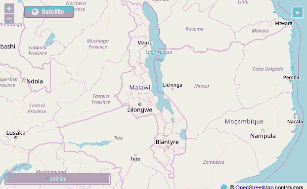
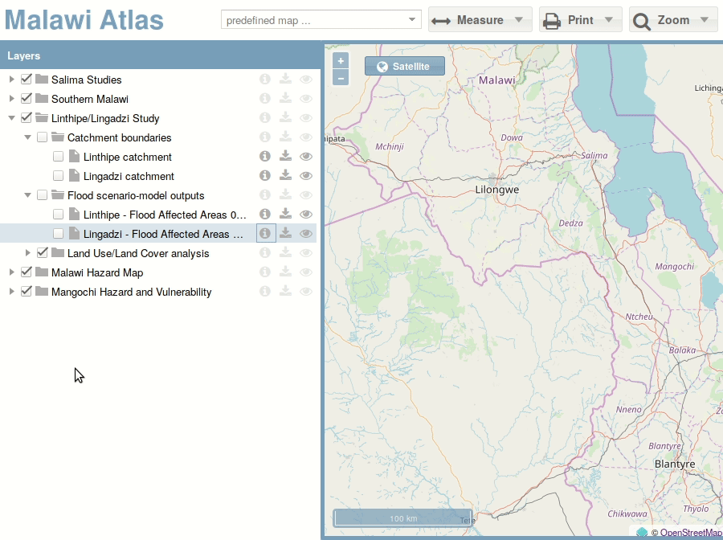
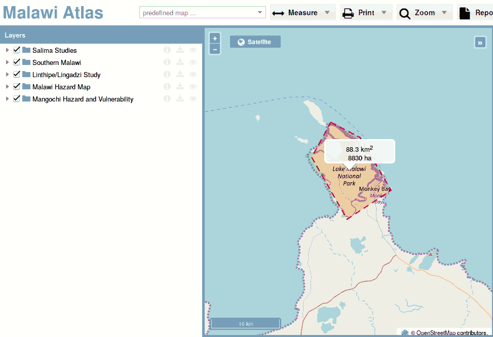
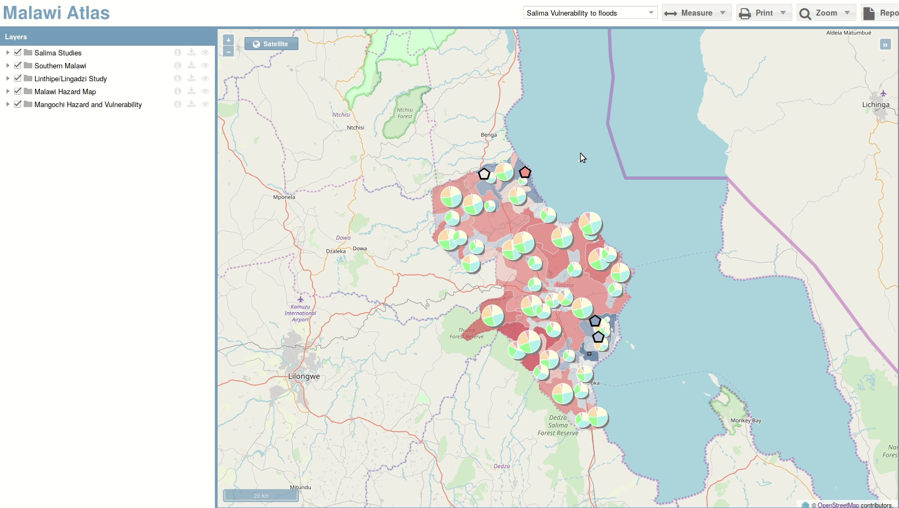

Website
========

The Malawi Atlas is a website which is targeted to desktop computers. It does
**not** work on mobile devices like tablets or smartphones.

Map
---

The map is the main component of the Malawi Atlas. It displays
all layers in the Web Mercator projection (EPSG:3857).

* The map can be navigated by panning with the mouse. Zooming is possible with the mouse wheel, a double-click or with the zoom buttons on the top left.
* The button on the top right activates an overview map.
* Clicking `Shift` makes it possible to draw a rectangle where the map shall be zoomed to.
* The basemap can be switched from topographic to satellite using the basemap button on the top left.

Layer Tree
----------

The layer tree on the left side holds all available layers. Each layer is grouped in a parent group and a sub group.

* Hovering over the items shows an description.
* Ticking a layer or a layer group toggles the visibility of the layer.
* Each layer has an information button. Clicking this one opens up a information panel on the bottom left.
* The download button downloads the layer in the GeoPackage format which can be displayed in a desktop GIS like QGIS. Downloading only works for vector data, downloading raster data is not supported.
* The "eye" symbol can change the transparency of the layer
* The layers can be re-ordered by clicking on them and draging them to the required position.

Predefined Map
--------------

.. image:: img/predefined_map.gif

In the top toolbar is a combobox which shows some predefined map configuration. Each of them selects some layers and zooms to them.

Feature Info
------------

.. image:: img/feature_info.gif

For some layers information about features can be shown. These can be accessed by clicking on the respective feature. Then a info panel will be shown on the bottom left. For some layers some charts will be displayed.

Legend
------

The legend panel on the right side displays the legends of all visible layers.

Measure
---------

The measure button in the toolbar makes it possible to measure areas and distances by clicking on the map. Distances are displayed in kilometer, areas in square kilometer and hectare. A measurement can be finished by double clicking. Another single click on the map deletes the measurement.

Print
-----

The print button makes it possible to print a PDF of the visible map extent. The user can enter a title or a description. These fields are however not required. An simple image of the map can be downloaded by right-clicking on the map. Then choose `Save image As...`.

Zoom to
-------

.. image:: img/zoom.gif

The zoom button in the top toolbar contains three options:

* A button for zooming to the whole country Malawi
* A combobox for all districts. They can also be searched by typing into the field.
* A combobox for the traditional authorities of the chosen district.
